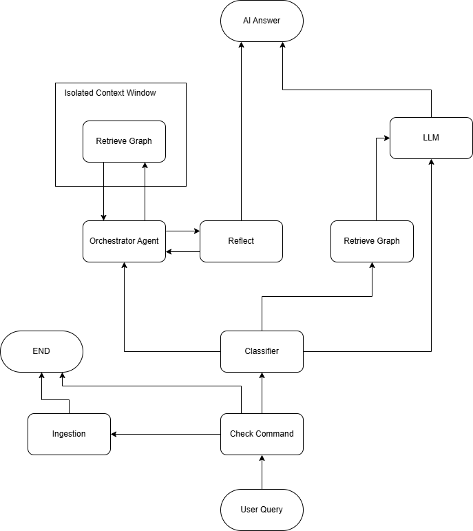
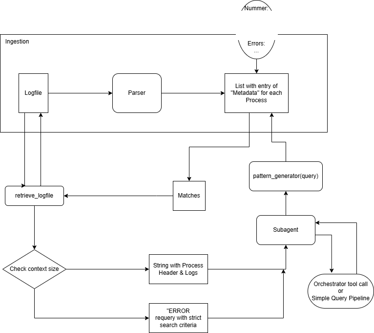

# Architecture of LogfileAnalyzer

## TOC:

[Description](#logfileanalyzer-description-and-capabilities)

[Components](#components)

[Graph Architecture](#graph-architecture)

[Prompt Architecture](#prompt-architecture)

## LogfileAnalyzer Description and Capabilities

This Agent can search in a Logfile for logged Processes and gives an analysis on it in a question answering design.

While searching for Processes, it uses the following **Data Schema**, which is part of the Process structure:

```
Process Header:
	- Start Index: [int]
    - End Index: [int]
    - Start Timestamp: [hh:mm:ss:xxx]
    - End Timestamp: [hh:mm:ss:xxx]
    - Nummer: [int]
    - Errors: [int]
    - Warnings: [int]
```

As of now, there is no Class to define the Data Schema for *your* Logfile. you must go trough all files and adapt it to your Logfile Data Schema.

**Classification:**

The Classifier determines how complex the query is in relation to your Logfiles and routes it to one of the following pipelines:
- Classify **A**: "Straight Forward" query is routed only to a LLM.
- Classify **B**: "Simple Query" query is routed to the Retrieve Agent. then the Agent's output is being synthesized into an answer by a LLM.
- Classify **C**: "Complex Query" query is routed to the Orchestrator Agent, where the Agent creates a plan with subtasks and completes the plan in multiple turns, using the Retrieve Agent for context gathering. Once the Agent has an answer, it is being checked by the reflect LLM for correctness and completeness, before presenting the answer to the user.

**Strategy:**

When a query is being given to the graph, its first being parsed for commands. Some commands are triggering a retrieval (*strategy **A***) while others are triggering ingestion (*strategy **B***) or only set the environment (*strategy **C***)

**Context window:**

The Retrieve Agent has an isolated context window so that it doesnt bloat the context window of the "messages" state with the huge amount of Logdata it usually retrieves. 

## Components:

**graph-framework/** Backend logic of the LogfileAnalyzer agent. For testing it can be run in the Terminal with a single query

> graph.py, nodes.py and tools.py is the standard architecture in LangGraph. logfile_retriever.py has the retrieve logic and is being utilized by tools.py

**langgraph-server/** contains a copy of the graph-framework/ and is hosting it for the chat ui

> a slightly modified copy of *graph-framework/* is in *src/rag_agent/*. in *langgraph.json* the Graph ID is defined as *rag_agent*. this ID must match with the subfolder under *src/* and the main graph in *graph.py* must have the variable name *graph*

**agent-chat-ui/** server for chat ui, connecting with langgraph-server/, client running in Browser

**mod-agent-chat-ui/** 2 modified files for agent-chat-ui

**config/** has `config.json` for Linux and `config_win.json` for Windows and prompts for the backend

- FILES_PATH defines the path where `ingesting_logfile` searches for Logfiles

- LLM_MODEL defines which model is being used

- *_PROMPT_PATH are the prompts used in the graph

- MAX_REFLECTIONS and MIN_REFLECTIONS are restricting the amount of reflection loops

- MAX_RETRIEVAL limits the amount of logfile lines that will be passed to the subagent. if this number exceeds the limit, it returns a warning.

- QUERY_SAMPLE is the query given to graph-framework/ if running it in the terminal

**doku/** Documentation

**logfile-sammlung/** Here are the Logfiles stored, that the agent has access to

**prompt-engineer/** A simple LLM pipeline to generate or refine prompts

**qa_generator/** Based on graph-framework/, this graph generates and validates queries for the retrieve_logfile_tool, to raise Q&A pairs

## Graph Architecture:

**current state of the pipeline:**



*Note: the Retrieve Graph can not see the Message History of the Main Graph. It only receives the last message as input and returns his results in a schema. On every Invoke the Retrieve Graph wipes its internal Message History.*

**pipeline for retrieval**



## Prompt Architecture:

This section explains, which Prompt and Tool description is being used by which LLM / Agent, how they are interlinked and a pseudo code of the LLM's context window.

**Classifier:** has the `classifier_prompt.txt`. It defines the Classes and instruct the LLM for a structured output.

> `[classifier prompt] + [messages state] = [classify {A, B, C}]`

**Orchestrator Agent:** has the `system_prompt.txt` which instructs the workflow and the output to the user, and the tool description of `retrieve_logfile_assistant()` which explains how to operate the Retrieve Agent and what output to expect.

> `[system prompt] + [messages state] = [tool call || final answer]`

**Retrieve Agent:** has the `retriever_prompt.txt` which instructs the workflow and output aswell, and the tool description of `retrieve_logfile_tool()` which explains accurately the operation of the retrieve tool.

> `[isolated context state] + [retriever prompt] = [tool call || final answer]`

**Pattern Generator:** has the `pattern_generator_prompt.txt` with strict instructions on how to interpret the query and generate a correct RegEx search pattern for the VisionGuide Logfiles.

> `[pattern generator prompt [query]] = [pattern]`

**Reflect:** has instructions in `reflect_prompt.txt` on what to pay attention for in the Orchestrators output and how to grade it. 

> `[reflect prompt] + [messages state] = [grade] + [feedback]`

